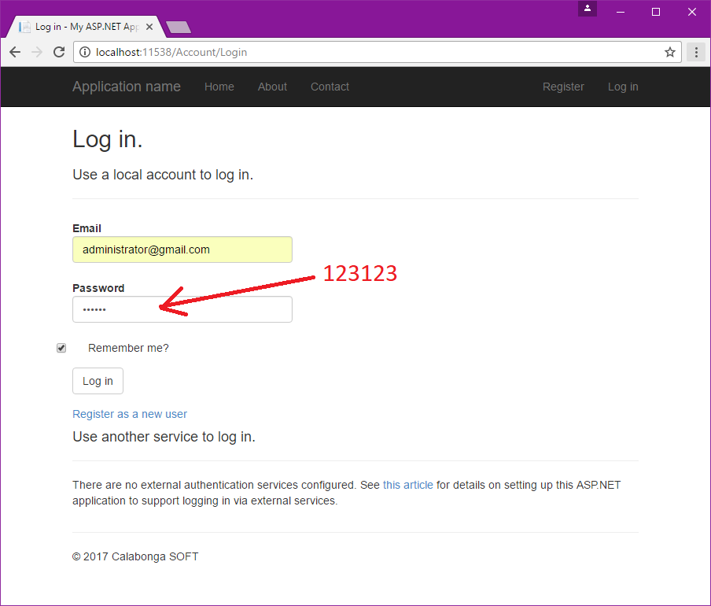
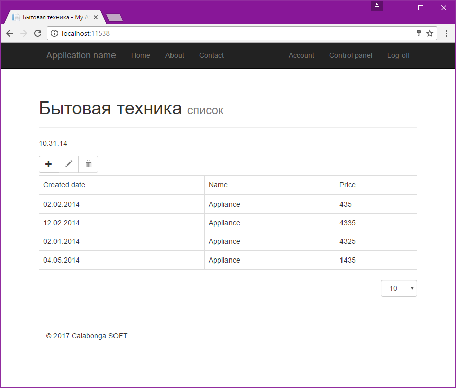
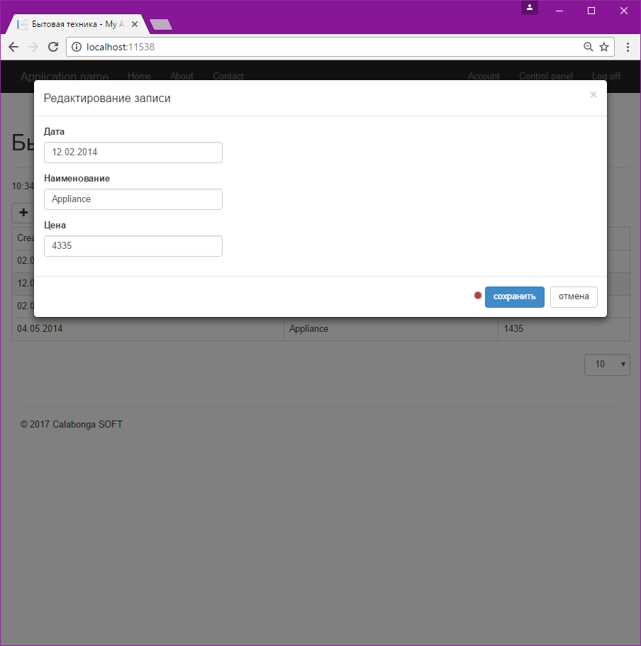
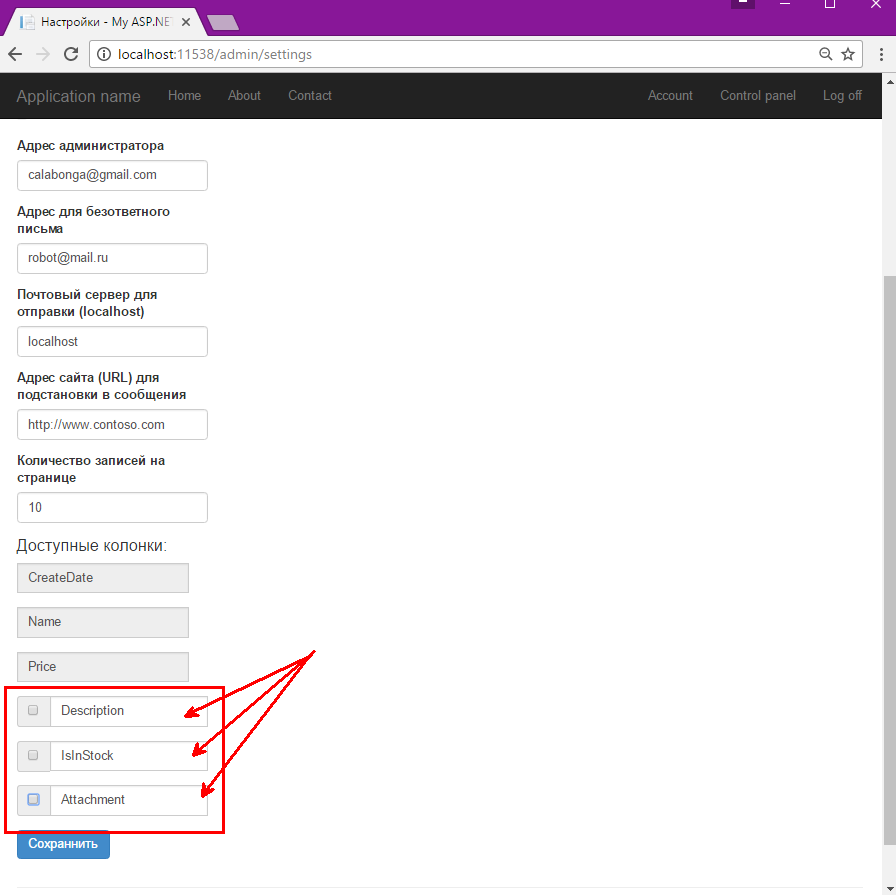
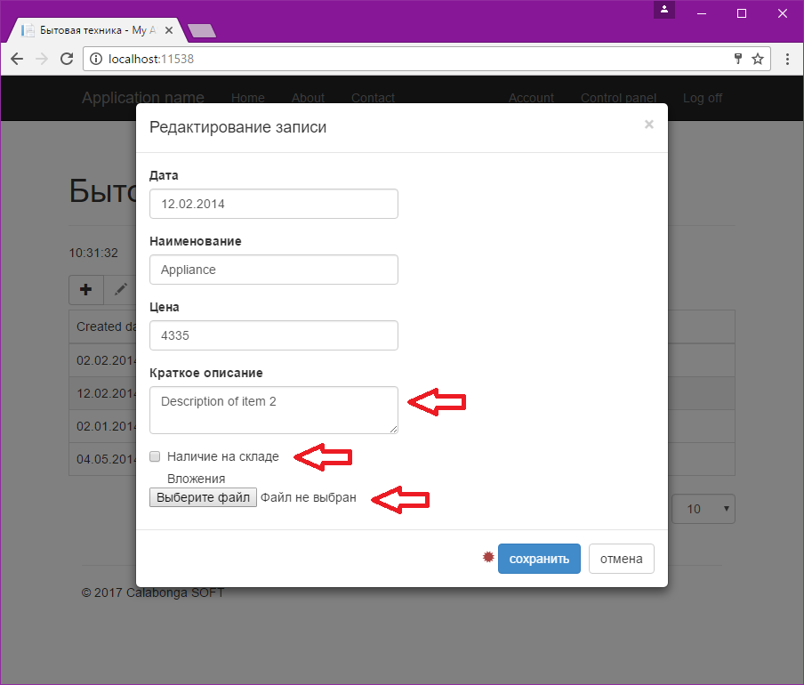

# Управление колонками сущности
Тестовое задание для вакансии "Разаработчик ASP.NET": "Управление видимостью свойствами (колонками) сущности на форме редактирования".

## Функциональные требования
Разработать сайт на ASP.NET MVC со списком товаров, где список колонок для пользователей, которые могут просмотривать, редактировать, добавлять и удалять товары должен управляться администратором сайта. Есть обязательные колонки и фиксированные колонки. Есть набор колонок которые могут открыты/закрыты для редактирования.

## Снимки с экрана

